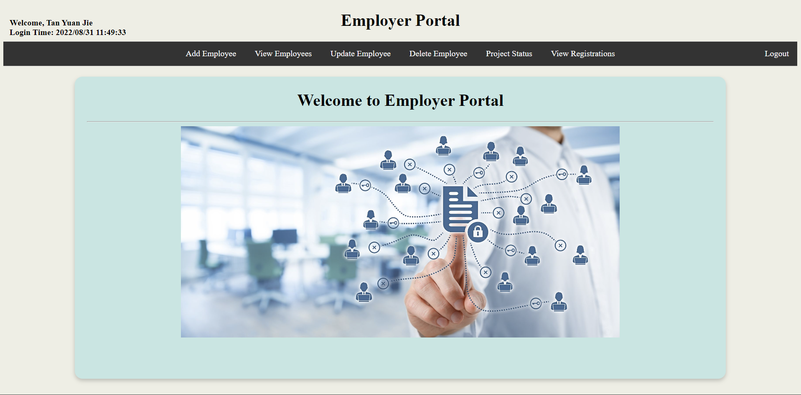

# HRMS Portal - Web Application

<!-- ALL-CONTRIBUTORS-BADGE:START - Do not remove or modify this section -->

<!-- ALL-CONTRIBUTORS-BADGE:END -->

## Overview

This is a web-based HRMS portal. HRMS stands for Human Resources Management System. There are two types of end users exist in the system: employer and employee. Both employer and employee have their own portals. Employer is only allowed to access employer portal, while employee is only allowed to access employee portal. In addition, if the employee is a project manager, he will access the project manager portal after logging in.

## Features

1. Sign Up 
   The user can sign up as the employee. However, the user can only login if the employer reviews and adds the user as an employee into the system.

2. Login 
   The user can log in to the system using their valid username and password. The default username is the name of the user, while the default password is the email of the user.

### Employer Features

1. Add Employee 
   The employer can add the employee by entering the employee's details such as name, department, email, contact number and role.

2. View Employee 
   The employer can view all the employees added to the system.

3. Update Employee 
   The employer can update the employee details by selecting the employee and entering the new details of the employee.

4. Delete Employee 
   The employer can delete the employee by selecting the employee and confirm the book deletion.

5. View All Project Status 
   The employer can view all the project status assigned to the employees and proejct managers.

6. View Registrations 
   The employer can view all the registrations submitted by the users.

### Project Manager Features

1. View Employees 
   The project manager can view all the developers. Besides, the project manager can also assign a project to the developer.

2. View Employee's Project Status 
   The project manager can view all the status of the assigned projects.

### Employee Features

1. View Projects 
   The employee can view all the projects assigned to them. Besides, the employee can either accept or reject the project assigned.

## Tech Stack

- Java 8
- Servlet
- HTML
- CSS
- JavaScript
- Hibernate
- Oracle DB
- Apache Tomcat 9.0

## System Design

The system follows the MVC design pattern.

- HTML, JavaScript and CSS act as the View.
- Servlet acts as the Controller and View.
- Data Access Object (DAO) and java bean act as the Model.

## Preview

1. Home Page     
2. About Us     
3. Contact Us     
4. Login     
5. Sign Up    

### Employer

1. Home Page     
2. Add Employee     
3. Update Employee     
4. View Employees     
5. Delete Employee     
6. View All Project Status     
7. View Registrations     

### Project Manager

1. Home Page     
2. View Employees     
3. View Employee's Project Status     

### Employee

1. Home Page     
2. View Projects     

## Contributors ✨

Thanks goes to these wonderful people ([emoji key](https://allcontributors.org/docs/en/emoji-key)):

<!-- ALL-CONTRIBUTORS-LIST:START - Do not remove or modify this section -->
<!-- prettier-ignore-start -->
<!-- markdownlint-disable -->
<table>
  <tr>
    <td align="center"><a href="https://github.com/yuanjie8629"> <b>Tan Yuan Jie</b></a> <a href="#a11y-yuanjie8629" title="Accessibility">️️️️♿️</a> <a href="#question-yuanjie8629" title="Answering Questions">💬</a> <a href="https://github.com/yuanjie8629/HRMSPortal/commits?author=yuanjie8629" title="Code">💻</a> <a href="#data-yuanjie8629" title="Data">🔣</a> <a href="#design-yuanjie8629" title="Design">🎨</a> <a href="https://github.com/yuanjie8629/HRMSPortal/commits?author=yuanjie8629" title="Documentation">📖</a> <a href="#ideas-yuanjie8629" title="Ideas, Planning, & Feedback">🤔</a> <a href="#infra-yuanjie8629" title="Infrastructure (Hosting, Build-Tools, etc)">🚇</a> <a href="#maintenance-yuanjie8629" title="Maintenance">🚧</a> <a href="https://github.com/yuanjie8629/HRMSPortal/pulls?q=is%3Apr+reviewed-by%3Ayuanjie8629" title="Reviewed Pull Requests">👀</a> <a href="#tool-yuanjie8629" title="Tools">🔧</a></td>
  </tr>
</table>

<!-- markdownlint-restore -->
<!-- prettier-ignore-end -->

<!-- ALL-CONTRIBUTORS-LIST:END -->

This project follows the [all-contributors](https://github.com/all-contributors/all-contributors) specification. Contributions of any kind welcome!
